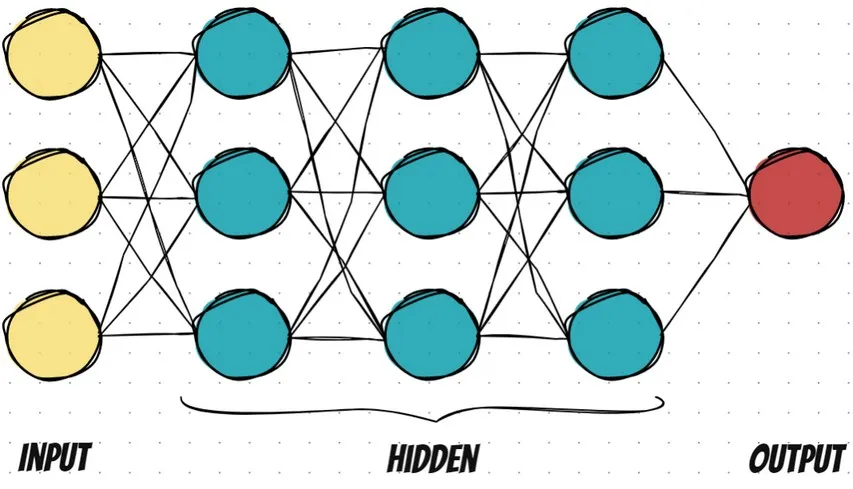

# Deep Neural Network from Scratch 



A modular, beginner-friendly implementation of a **feedforward neural network** from scratch using **NumPy** — no deep learning frameworks involved! This project trains a neural net on the **MNIST handwritten digits dataset**, covering all essential components: forward pass, backpropagation, loss functions, optimizers, and activation functions.

---

## Project Structure

```
deepnn-from-scratch/
├── core/                  # Core neural net components
│   ├── layer.py           # Linear layer module
│   ├── activations.py     # ReLU, Sigmoid, Tanh, etc.
│   ├── losses.py          # MSE, CrossEntropy
│   └── optimizers.py      # SGD, Momentum, Adam
│
├── models/
│   └── neural_network.py  # NeuralNetwork class
│
├── data/
│   └── mnist_loader.py    # Load, normalize, split MNIST dataset
│
├── experiments/
│   └── config.yaml        # Model/training hyperparameters
│
├── notebooks/
│   └── demo_mnist.ipynb   # Code walkthrough and visualization
│
├── docs/
│   ├── architecture/      # Visual explanation of ANN
│   │   └── architecture.md
│   └── math_explanation.md# Deep dive into forward/backward math
│
├── train.py               # Model training script
├── test.py                # Model evaluation script
├── utils.py               # Accuracy, metrics, helpers
├── requirements.txt       # Project dependencies
└── README.md              # You're here!
```

---

## Features
- Full **forward & backward propagation**
- Layer stacking with custom config
- Supports multiple **activation functions**
- **Loss functions**: MSE and CrossEntropy
- **Optimizers**: SGD, Momentum, Adam
- **Train/test scripts** and logging
- Modular structure (easy to extend)

---

## How to Use

### 1. Clone the repository
```bash
git clone https://github.com/yourusername/deepnn-from-scratch.git
cd deepnn-from-scratch
```

### 2. Set up environment
```bash
python -m venv venv
source venv/bin/activate  # or .\venv\Scripts\activate on Windows
pip install -r requirements.txt
```

### 3. Train the model
```bash
python train.py
```

### 4. Evaluate the model
```bash
python test.py
```

---

## Results
Trained on MNIST with the following configuration:
- Hidden layers: `[128, 64]`
- Activation: `ReLU`
- Loss: `Categorical CrossEntropy`
- Optimizer: `Adam`

Achieved validation accuracy > **97%** after 20 epochs 🎉

---

## Documentation
- **Math Explanation**: [`docs/math_explanation.md`](docs/math_explanation.md)
- **Neural Net Intuition**: [`docs/architecture/architecture.md`](docs/architecture/architecture.md)
- **Jupyter Demo**: [`notebooks/demo_mnist.ipynb`](notebooks/demo_mnist.ipynb)

---

## Credits
Inspired by biological neural networks, built with ❤️ and NumPy.

---

## Future Improvements
- Add model saving/loading in JSON
- Add Dropout, BatchNorm
- Support for more datasets (e.g. CIFAR-10)
- UI via Streamlit or Gradio

---

## License
This project is licensed under the MIT License.

---

> If you like this project, consider ⭐ starring the repo to support it!

---

## Project Author

| Name           | Contact Information                                                  |
|----------------|----------------------------------------------------------------------|
| **Surakiat P.** |                                                                      |
| 📧 Email       | [surakiat.0723@gmail.com](mailto:surakiat.0723@gmail.com)   |
| 🔗 LinkedIn    | [linkedin.com/in/surakiat](https://www.linkedin.com/in/surakiat-kansa-ard-171942351/)     |
| 🌐 GitHub      | [github.com/SurakiatP](https://github.com/SurakiatP)                 |
