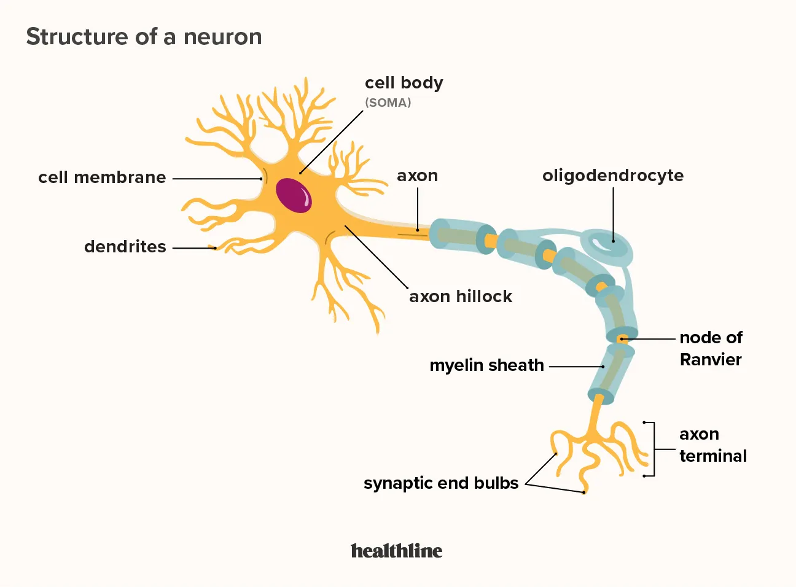
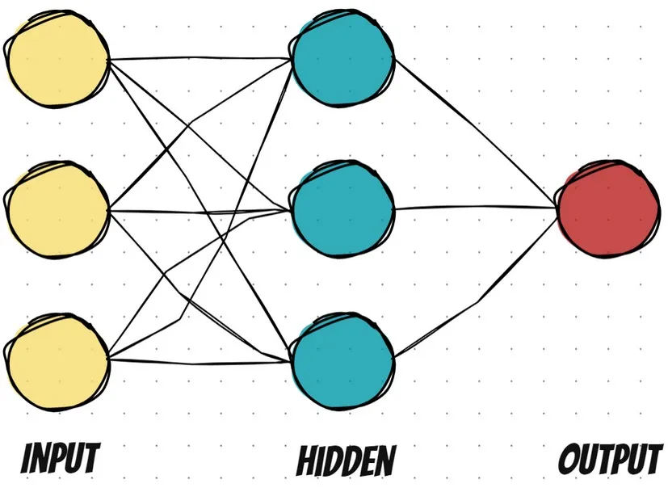
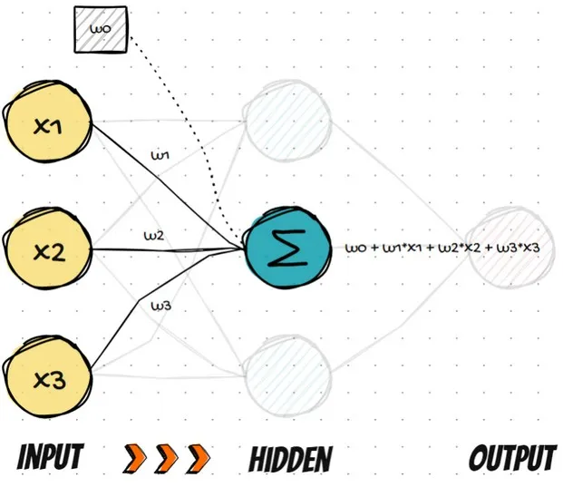
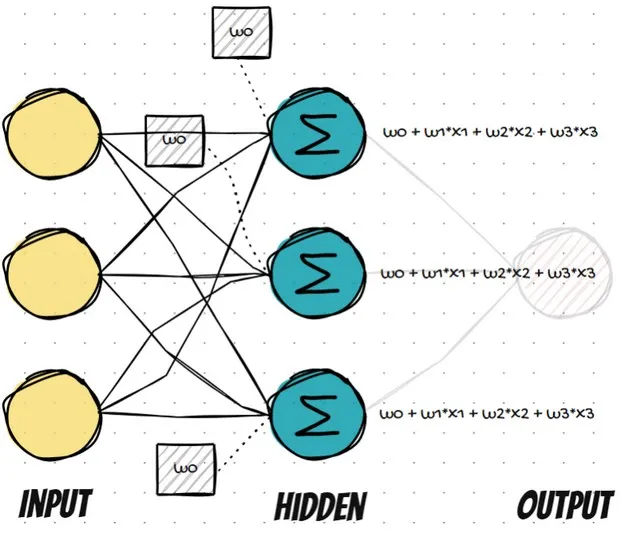
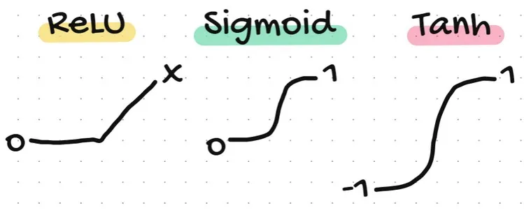
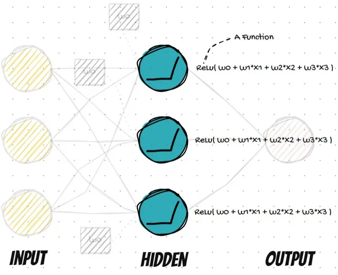
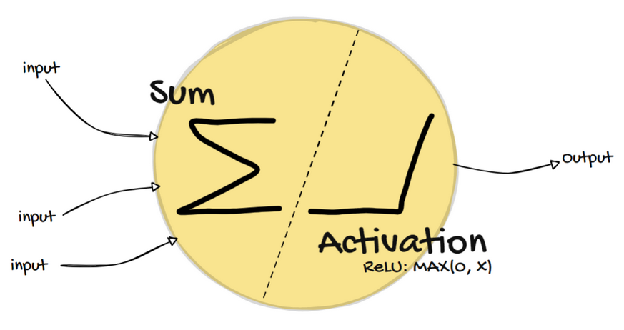
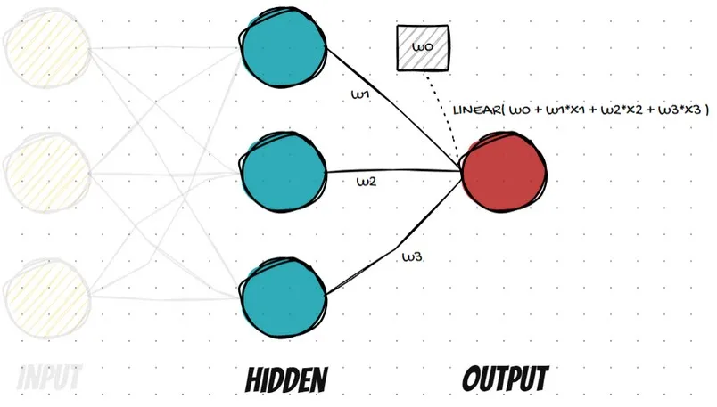

# Introduction to Neural Networks



The human brain is composed of approximately **86 billion neurons**, each functioning as a fundamental unit of computation. A neuron includes:

- **Cell body (soma):** Central processing unit
- **Dendrites:** Receive input signals
- **Axon:** Sends output signals

These neurons transmit **electrical and chemical signals** to form highly complex **neural networks**, which inspire artificial neural networks (ANNs) in machine learning.

---

## Artificial Neural Networks (ANNs)



ANNs are inspired by biological neural networks and are:

- **Complex**: Handle high-dimensional data like images
- **Powerful**: Learn non-linear functions through depth and structure

In this project, we use a **Feedforward Neural Network with a Single Hidden Layer**. Here's the architecture:

- **Input Layer**: 3 neurons (3 features from MNIST dataset)
- **Hidden Layer**: 3 neurons (customizable)
- **Output Layer**: 1 neuron (for class prediction)

Each layer transforms the input using weighted sums and activation functions.

---

## 1. Weighted Sum



Each neuron performs a **weighted sum** of its inputs:

```
output = w0 + w1*x1 + w2*x2 + w3*x3
```



This is equivalent to **linear regression**.

> Note: `w0` is a bias term used to shift the output for more flexible modeling.

---

## 2. Activation Functions

Activation functions introduce **non-linearity** into the network, allowing it to learn complex mappings.



Popular activation functions:

- **ReLU**: `max(0, x)`
- **Sigmoid**: `1 / (1 + exp(-x))`
- **Tanh**: `(exp(x) - exp(-x)) / (exp(x) + exp(-x))`



These are applied after the weighted sum:

```python
# Python Example
import numpy as np
x = np.array([1, 2, 3])
w = np.array([0.5, -0.4, 0.25])
b = 0.1

weighted_sum = b + np.dot(w, x)
output = np.maximum(0, weighted_sum)  # ReLU activation
```



---

## Output Layer

The final layer computes the prediction. For regression tasks, this can be a linear function:



```
y_hat = w0 + w1*x1 + w2*x2 + w3*x3
```

### Error Calculation:

Using **Mean Squared Error (MSE)**:

```python
actual = np.array([9, 9, 8])
prediction = np.array([10, 8, 5])
MSE = np.mean((actual - prediction)**2)  # Result: 3.67
```

This is referred to as the **loss function**.

---

## Backpropagation

This is the key to **learning** in neural networks. It works by sending **error signals** from the output layer back through the network to **adjust weights**.

Combined with **gradient descent**, the goal is to minimize the loss:

```python
w = w - learning_rate * gradient_w
```

This iterative process improves model predictions over time.

---

## Summary

- ANNs mimic biological neurons in simplified form
- Each neuron performs:
  1. Weighted sum
  2. Activation
- Output layer computes predictions
- Loss is calculated (e.g., MSE)
- Backpropagation adjusts weights

> This document complements our project using the MNIST dataset, where images are passed through a feedforward neural network, trained via backpropagation and gradient descent to classify digits accurately.

