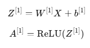
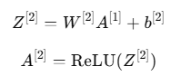
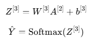
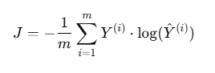
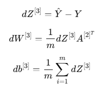
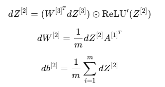
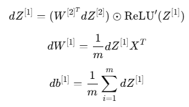
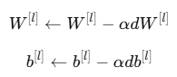

# Mathematical Explanation of Forward and Backward Propagation

This document provides a detailed mathematical overview of forward and backward propagation as implemented in the `deepnn-from-scratch` project.

## Project Overview

The neural network is built from scratch to classify images from the MNIST dataset. The architecture is as follows:

- **Input Layer:** 784 neurons (28x28 pixels flattened)
- **Hidden Layers:**

  - Layer 1: 128 neurons, ReLU activation
  - Layer 2: 64 neurons, ReLU activation
  
- **Output Layer:** 10 neurons, Softmax activation
- **Loss Function:** Categorical Cross-Entropy

## Forward Propagation

Forward propagation computes predictions \( Y^ \) by passing input \( X \) through the network layer by layer:

### Layer-by-Layer Equations:

**Hidden Layer 1:**



**Hidden Layer 2:**



**Output Layer:**



### Matrix Dimensions:

```
    Input 𝑋 : (784,𝑚)
    𝑊^[1] : (128,784), 𝑏^[1] : (128,1)
    𝑊^[2] : (64,128),𝑏^[2] : (64,1)
    𝑊^[3] : (10,64), 𝑏^[3] : (10,1)
    Output 𝑌^ : (10,m)
```

## Backward Propagation

Backward propagation calculates gradients of the loss with respect to network parameters to update them via gradient descent.

### Loss Function (Categorical Cross-Entropy):



### Gradient Calculations:

**Output Layer:**



**Hidden Layer 2:**



**Hidden Layer 1:**



### Parameters Update (Gradient Descent):



where \( \alpha \) is the learning rate.

## Why Neural Networks Work Well with MNIST

- MNIST consists of structured yet high-dimensional image data.
- Neural networks efficiently handle large feature spaces and complex relationships through hierarchical learning.
- Layer-wise processing allows the model to learn representations from simple to complex features progressively, making it highly effective for image classification tasks like MNIST.
